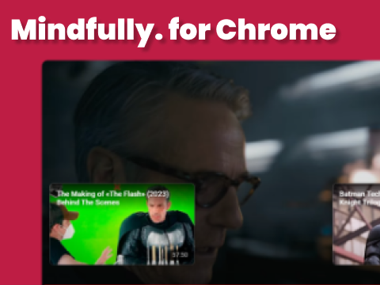
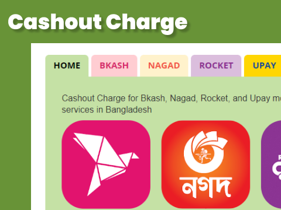

# [Tamal Anwar Chowdhury](https://www.linkedin.com/in/tamalchowdhury/)

Experienced Frontend Developer seeking remote opportunities to leverage my expertise in building innovative web applications. With a decade of expertise in web development, I specialize in crafting modern, scalable web applications using React, Next.js 14, TypeScript, CSS Grid, Flexbox, Prisma, MongoDB, and Git. My strong foundation in HTML, CSS, and JavaScript, combined with a deep understanding of frontend architecture and best practices, enables me to deliver high-quality, user-centric solutions.

My experience with tools like Prisma and MongoDB allows me to collaborate effectively with full-stack teams, ensuring a seamless development process. While I have a solid understanding of backend technologies, my primary focus and passion lie in frontend development.

I am particularly interested in building SaaS platforms and website builders, where I can apply my skills to create solutions that drive business value and delight users.

### Projects

| **MySocial Page Builder** | **Mindfully. Chrome Extension** |  **Cashout Charge** |
| --- | --- | --- |
|     Create a One Page Website for All Your Digital Profiles. Create a page for your business, your project, or yourself. It's free!  |     Mindfully Hides YouTube end cards so you don't miss the climax part of the music video or movie clip.   |     Cashout Charge for Bkash, Nagad, Rocket, and Upay mobile financial services in Bangladesh  |

### More Projects

- [McKenzie and Paz Builders website](https://mckenzieandpazbuilders.vercel.app/) in Next.js 14, TailwindCSS, and TypeScript
- [Terindah Photography](https://indah-portfolio-js.vercel.app/) Made with HTML, CSS, JavaScript

### Articles

- [Best Practices on How to Compress Images For Reactjs](https://tamalweb.com/compress-images-reactjs)
- [Mastering JSON in ReactJS](https://tamalweb.com/json-reactjs)
- [Create a Local Development Environment on Windows](https://www.digitalocean.com/community/tutorials/how-to-install-node-js-and-create-a-local-development-environment-on-windows)
- [How To Set Up a React Project with Vite](https://www.digitalocean.com/community/tutorials/how-to-set-up-a-react-project-with-vite)
- [React Redux - A Complete Guide With Examples & Use Cases](https://memberstack.com/blog/react-redux)
